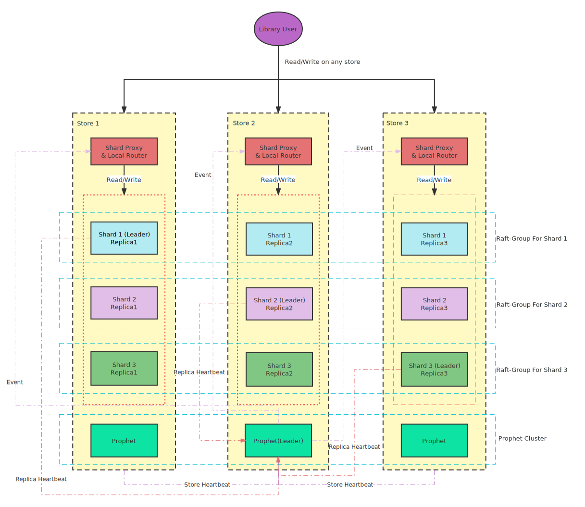

# MatrixCube — Distributed System Made Easy

MatrixCube is a [Golang](https://go.dev/) library for building distributed systems with high reliability and scalability. It tries to abstract away complexity of distributed systems and let developers to focus on their business logics. 

The current implementation is based on a multi-group [Raft](https://raft.github.io/) design in which data is distributed and replicated across many Raft groups each with multiple replicas for high data availability. Strong consistentcy provided by the Raft protocol allows developers to more easily reason about their data when compared with weaker form of consistency, e.g. eventually consistent systems. 

Internally, a well defined Key-Value [storage interface](https://github.com/matrixorigin/matrixcube/tree/main/storage) allow different storage engines to be integrated with MatrixCube to be presented as [Replicated State Machines](https://en.wikipedia.org/wiki/State_machine_replication). Such Replicated State Machines are accessed via a simple [client](https://github.com/matrixorigin/matrixcube/blob/main/client/client.go) interface so that all complexities such as routing and timeout retries are transparently handled by our library.

With high availability and performance on the top of our priority list, MatrixCube employs a [Google Placement Driver](https://static.googleusercontent.com/media/research.google.com/en//archive/spanner-osdi2012.pdf) style component for automatic movement of data to balance load or repair Raft groups with failed replicas. 

MatrixCube's architecture is visualized in the following diagram - 



To the maximum of our knowledge, MatrixCube is currently the only open source library that provides all above features in a single Go library. 

## Features

* Multi-group Raft for high availability
* Strongly consistent storage
* Unlimited horizontal scalability
* Automatic load rebalancing & failure recovery
* Pure Go implementation 

## Usage

To add MatrixCube to your project - 

```
go get github.com/matrixorigin/matrixcube@latest
```

## Example

See our TinyKV example on how to use MatrixCube for building a highly scalable & strongly consistent Key-Value store.

## License

MatrixCube is licensed under the Apache version 2.0 license. It contains source code licensed from 3rd parties, details are [here](https://github.com/matrixorigin/matrixcube/tree/master/licenses).
